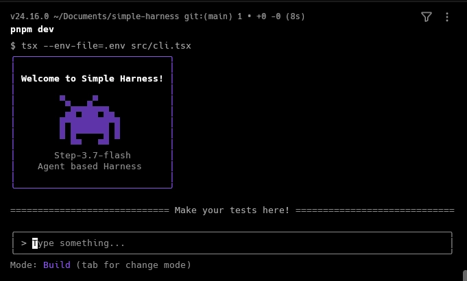

# Simple Harness

**Simple Harness** is an autonomous, terminal-based software engineering assistant (TUI) powered by LLMs. It allows you to plan and execute coding or automation tasks directly in your local repository.

> [!NOTE]
> This project is inspired by famous agent harnesses in the market like **Claude Code**, **antigravity-cli**, and **Codex**, serving as a simplified and lightweight version of them.

## Technology Stack

| Technology | Purpose |
| :--- | :--- |
| **Node.js** | Core JavaScript runtime environment (requires `>= 20.6.0`). |
| **TypeScript** | Static typing and enhanced developer tooling. |
| **React & Ink** | Component-driven rendering of the terminal user interface (TUI). |
| **Vercel AI SDK** | Seamless tool calling integration with LLMs. |
| **Zod** | Schema-based validation for environment variables. |
| **TSX** | On-the-fly TypeScript execution without manual compilation. |
| **Biome** | Fast code linting and formatting. |

## How It Works

Simple Harness runs a two-step agent workflow. You can toggle between these modes inside the terminal using the `Tab` key:

### 1. Plan Mode (Read-Only)
* **What it does**: Explores the codebase using read-only tools.
* **Outputs**: Produces a detailed markdown implementation plan.
* **Safety**: Does not make any code changes or execute commands.

### 2. Build Mode (Write-Enabled)
* **What it does**: Reads, creates, or modifies files and executes terminal commands.
* **Safety**: Any tool that alters the system (like writing a file or running a terminal command) suspends execution to request user confirmation (`needsApproval`) within the TUI.

## Getting Started

### Prerequisites
- **Node.js** (version `>= 20.6.0` for native `--env-file` support)
- **pnpm** (recommended package manager)

### 1. Installation
Install the project dependencies:
```bash
pnpm install
```

### 2. Configuration
Copy the environment variables template:
```bash
cp .env.example .env
```
Open `.env` and enter your NVIDIA API credentials:
```env
NIM_API_KEY="your-api-key-here"
NIM_BASE_URL="https://integrate.api.nvidia.com/v1"
```

### 3. Run
Start the development terminal interface:
```bash
pnpm dev
```

## License

This project is licensed under the [MIT License](https://github.com/marco-around/llink/blob/main/LICENSE) © [Marco Around](https://github.com/marco-around).
